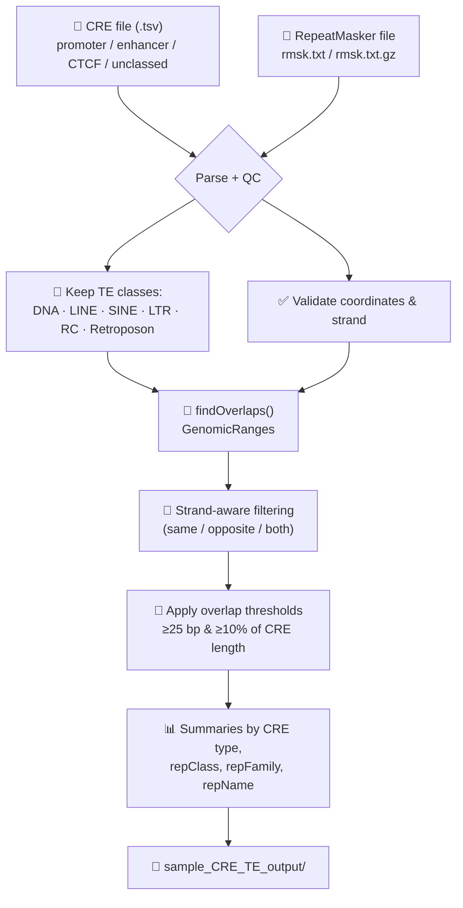

<div align="center">

# 🧬 TE-CRE Overlap Analysis

### Decoding transposable element-derived regulatory motifs in the human transcriptome

*Companion analysis script for CFC-seq-based characterization of TE-derived cis-regulatory elements (tCREs) across human cell types*


</div>

---

## 🔭 Overview

Transposable elements (TEs) make up nearly **half of the human genome**, yet whether TE-derived sequences embedded in human transcripts are passive evolutionary remnants or **functional RNA/regulatory modules** is still an open question.

This repository contains the analysis code used to intersect **transcribed cis-regulatory elements (tCREs)** — defined from precise, long-read-resolved transcription start sites (CFC-seq) — with **transposable element annotations** (UCSC RepeatMasker), across multiple human cell types (iPSCs, differentiated neurons, THP-1, HEK293).

> 🧫 **CFC-seq** combines Cap-trapping and poly(A)-tailing long-read sequencing, enabling unambiguous mapping of highly repetitive TE families that short-read approaches cannot resolve — while preserving full-length transcript architecture across both coding and non-coding models.

<details>
<summary>📄 <b>Full abstract</b> (click to expand)</summary>

<br>

Transposable elements (TEs) constitute nearly half of the human genome and are increasingly recognized as contributors to transcriptional regulation, yet whether TE-derived sequences embedded in human transcripts represent passive evolutionary remnants or functional RNA modules remains poorly understood. To address this, we leverage CFC-seq, a long-read sequencing protocol that combines Cap-trapping and poly(A)-tailing to enable unambiguous mapping of highly repetitive TE families that are irresolvable by short-read approaches. The full-length transcript architecture allows TE-derived sequences to be examined within both coding and non-coding transcript models, while transcribed cis-regulatory elements (tCREs) defined from precise transcription start sites (TSSs) enable characterization of the transcription factor binding sites that TEs introduce. Applying CFC-seq to a panel of diverse human cell types — including iPSCs, differentiated neurons, THP-1, and HEK293 — TE-derived regulatory activity is investigated across distinct cellular contexts.

By integrating TE annotation with CFC-seq-derived full-length transcript models across multiple human cell types, this study systematically characterizes the roles of TEs as modular building blocks of the RNA regulatory architecture of the human transcriptome.

*(Results are omitted here pending publication.)*

</details>

---

## ⚙️ What the script does

`TE_CRE_analysis.R` takes a tCRE table and a UCSC RepeatMasker table and systematically computes, for **any** cell type / sample:



---

## 🧰 Requirements

- **R** (≥ 4.0)
- R packages: [`data.table`](https://cran.r-project.org/package=data.table), [`GenomicRanges`](https://bioconductor.org/packages/GenomicRanges/)

```r
install.packages("data.table")
if (!requireNamespace("BiocManager", quietly = TRUE)) install.packages("BiocManager")
BiocManager::install("GenomicRanges")
```

- A **CRE table** (`.tsv`) with at least `CREID` and `promoter_type` columns
  (`CREID` format: `chr_start_end_strand`)
- A **UCSC RepeatMasker** table (`rmsk.txt` or `rmsk.txt.gz`)

---

## 🚀 Usage

```bash
Rscript TE_CRE_analysis.R <CRE_file.tsv> <rmsk_file.txt.gz>
```

**Example:**

```bash
Rscript TE_CRE_analysis.R SampleX.CRE.info.p.e.se.tsv rmsk.txt.gz
```

Only two arguments, always — the same command runs on **any** cell type / dataset with this file format (iPSC, neuron, THP-1, HEK293, or your own).

> 💡 Run the command from the folder containing `TE_CRE_analysis.R`, or give its full path:
> ```bash
> Rscript /full/path/to/TE_CRE_analysis.R "/full/path/to/SampleX.CRE.info.p.e.se.tsv" "/full/path/to/rmsk.txt.gz"
> ```

---

## 🔬 Pipeline details

| Step | What happens |
|---|---|
| 1️⃣ Sample naming | Sample name auto-detected from the CRE file name (e.g. `SampleX.CRE.info.p.e.se.tsv` → `SampleX`) |
| 2️⃣ CREID parsing | Split into chromosome / start / end / strand — robust to chromosome names that themselves contain underscores |
| 3️⃣ CRE classification (based on promoter_type column)| Kept: `promoter-like`, `enhancer-like`, `CTCF-alone`, `unclassed`. Anything else → excluded & saved separately |
| 4️⃣ TE filtering | Kept classes: `DNA`, `LINE`, `SINE`, `LTR`, `RC`, `Retroposon` (incl. uncertain `?` labels, e.g. `LINE?`) |
| 5️⃣ Overlap detection | `GenomicRanges::findOverlaps()`, with explicit same/opposite strand relationship reported |
| 6️⃣ Significance filter | Overlap ≥ **25 bp** *and* ≥ **10%** of CRE length (defaults, editable at the top of the script) |
| 7️⃣ Summaries | Per CRE type, per repeat class/family/name, plus % of each CRE type "hit" by each TE class |

---

## 📁 Output

Everything is written to `<SampleName>_CRE_TE_output/`:

| 📄 File | 📝 Content |
|---|---|
| `<sample>_CRE_TE_overlaps_all_raw.tsv.gz` | Every CRE–TE overlap found, unfiltered |
| `<sample>_CRE_TE_overlaps_filtered.tsv.gz` | Overlaps passing the significance thresholds |
| `<sample>_promoter_TE_overlaps_filtered.tsv.gz` | Filtered overlaps — promoter CREs only |
| `<sample>_enhancer_TE_overlaps_filtered.tsv.gz` | Filtered overlaps — enhancer CREs only |
| `<sample>_CTCF_TE_overlaps_filtered.tsv.gz` | Filtered overlaps — CTCF-alone CREs only |
| `<sample>_unclassed_TE_overlaps_filtered.tsv.gz` | Filtered overlaps — unclassed CREs only |
| `<sample>_CRE_TE_overall_summary.tsv` | One-row summary of the whole run |
| `<sample>_CRE_TE_summary_by_CRE_type.tsv` | Summary stats per CRE type |
| `<sample>_CRE_TE_summary_by_repClass.tsv` | Summary stats per TE class |
| `<sample>_CRE_TE_summary_by_repFamily.tsv` | Summary stats per TE family |
| `<sample>_CRE_TE_summary_by_repName.tsv` | Summary stats per individual repeat name |
| `<sample>_CRE_TE_percent_hit_by_repClass.tsv` | % of CREs of each type overlapping each TE class |
| `<sample>_other_CRE_labels_excluded.tsv.gz` | CREs with an unexpected `promoter_type` label *(if any)* |
| `<sample>_CRE_unknown_strand_excluded.tsv.gz` | CREs without a `+`/`-` strand *(if any)* |

---

## 🎛️ Default parameters

Fixed at the top of the script — edit there if a specific run needs different values:

```r
STRAND_MODE      <- "same"   # same | opposite | both
MIN_OVERLAP_BP   <- 25L
MIN_FRAC_CRE     <- 0.10
TE_CLASS_PATTERN <- "^(DNA|LINE|SINE|LTR|RC|Retroposon)\\??$"
```

---

## 🗂️ Repository structure

```
.
├── TE_CRE_analysis.R   # main analysis script
└── README.md           # you are here
```

> 🔒 Raw data (`*.tsv`, `rmsk.txt.gz`, `*_CRE_TE_output/`) is intentionally **not** tracked in this repo — see `.gitignore`.

---

## 📚 Citation

If you use this pipeline, please cite the associated study:

> *Decoding transposable element-derived functional RNA motifs in long non-coding RNAs across human cell types using long-read CFC-seq.*

*(Full citation to be added upon publication.)*

---

## 📬 Contact

Questions, issues, or suggestions , open an [issue](../../issues) on this repository!

<div align="center">

🧬 *made for exploring the dark matter of the genome* 🧬

</div>
