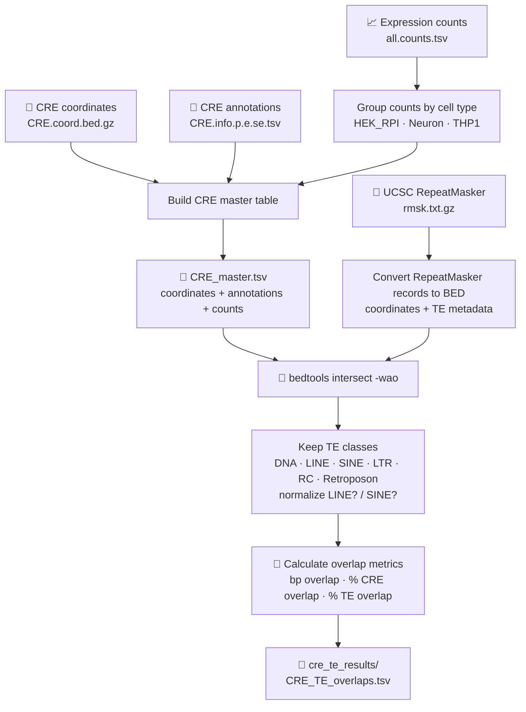

<div align="center">

# 🧬 CRE–TE Overlap Analysis

### Cell-type-aware annotation of CREs with transposable elements in HEK, Neuron, and THP1

*Python workflow for integrating CRE coordinates, CRE annotations, cell-type-resolved counts, and UCSC RepeatMasker annotations.*


</div>

---

## Overview

This repository contains a Python workflow for identifying overlaps between candidate cis-regulatory elements (CREs) and transposable elements (TEs) annotated by UCSC RepeatMasker.

The analysis integrates CRE-derived coordinates, CRE metadata, and expression/count information from three cellular contexts:

* **HEK**
* **Neuron**
* **THP1**

For each CRE, the script assigns a cell-type label from sample-name prefixes, aggregates counts across samples of the same cell type, intersects CRE genomic intervals with RepeatMasker intervals, and reports TE overlap metrics.

> This workflow analyzes CRE data generated upstream. It does not perform CRE calling, transcript assembly, or CFC-seq read processing.

---

## What the script does



### Workflow steps

| Step                              | Description                                                                                                   |
| --------------------------------- | ------------------------------------------------------------------------------------------------------------- |
| 1. Read CRE coordinates           | Reads the gzipped BED file containing CRE genomic intervals.                                                  |
| 2. Add CRE annotations            | Matches each `CREID` to its metadata in the CRE information table.                                            |
| 3. Aggregate counts               | Groups count-table columns by cell-type prefix and calculates total counts and the number of nonzero samples. |
| 4. Create a master CRE table      | Writes genomic coordinates, CRE annotations, cell type, and count information to `CRE_master.tsv`.            |
| 5. Prepare RepeatMasker intervals | Converts UCSC RepeatMasker records to BED-style intervals with TE name, class, family, orientation, and ID.   |
| 6. Find overlaps                  | Uses `bedtools intersect -wao` to identify genomic CRE–TE overlaps.                                           |
| 7. Retain TE classes              | Keeps DNA, LINE, LTR, SINE, RC, and Retroposon elements. Labels such as `LINE?` and `SINE?` are normalized.   |
| 8. Calculate overlap metrics      | Reports overlap length in base pairs and the percentage of CRE and TE sequence involved in each overlap.      |

---

## Cell-type assignment

Cell type is inferred from the prefixes of sample columns in the count table.

| Sample-column prefix | Output cell-type label |
| -------------------- | ---------------------- |
| `HEK_`               | `HEK_RPI`              |
| `Neuron_`            | `Neuron`               |
| `THP1_`              | `THP1`                 |

The script also contains optional mappings for `iPSC_` and `NSC_`; they are only used if matching sample columns are present.

---

## Requirements

* Python 3
* [`pybedtools`](https://daler.github.io/pybedtools/)
* [`bedtools`](https://bedtools.readthedocs.io/)
* A tab-delimited, gzipped UCSC RepeatMasker file
* CRE coordinate, annotation, and count files generated upstream

### Installation

Using Conda:

```bash
conda create -n cre-te python=3.10 -y
conda activate cre-te
conda install -c bioconda bedtools
python -m pip install pybedtools
```

Check that `bedtools` is available:

```bash
bedtools --version
```

---

## Input files

The script expects four inputs.

| Input              | Default path in the script                | Purpose                                               |
| ------------------ | ----------------------------------------- | ----------------------------------------------------- |
| CRE coordinates    | `bed/HEK_Neuron_THP1.CRE.coord.bed.gz`    | Genomic CRE intervals in BED format                   |
| CRE annotations    | `log/HEK_Neuron_THP1.CRE.info.p.e.se.tsv` | CRE-level metadata keyed by `CREID`                   |
| Count matrix       | `counts/HEK_Neuron_THP1.all.counts.tsv`   | Counts across samples, used for cell-type aggregation |
| RepeatMasker table | Set by `RMSK` in the script               | UCSC RepeatMasker annotation file (`rmsk.txt.gz`)     |

### CRE coordinate BED file

The CRE BED file must be:

* gzipped;
* tab-delimited;
* headerless;
* compatible with standard BED coordinates;
* on the same genome assembly as the RepeatMasker annotation.

The script uses the following first eight fields:

```text
chrom  start  end  CREID  cre_score  cre_strand  summit_start  summit_end
```

Rows with fewer than 12 columns are skipped by the current script.

### CRE annotation table

The CRE information table must:

* be tab-delimited;
* contain a header;
* use `CREID` in the first column;
* use matching `CREID` values to the coordinate BED file.

All annotation columns are retained in the master and overlap outputs. If an annotation field is named `orientation`, it is renamed to `cre_orientation` in the output.

### Count table

The count table must:

* be tab-delimited;
* contain a header;
* use `CREID` in the first column;
* contain integer counts in remaining columns;
* use sample names beginning with recognized cell-type prefixes, such as `HEK_`, `Neuron_`, or `THP1_`.

For each CRE and cell type, the script reports:

* `cell_type_total_count`: sum of all counts for that cell type;
* `nonzero_sample_count`: number of samples with a count greater than zero.

### RepeatMasker table

The RepeatMasker input must be a gzipped, tab-delimited UCSC-style `rmsk.txt.gz` file. It must use the same reference genome assembly and chromosome naming convention as the CRE BED file.

For example, do not mix `hg38` CRE coordinates with `hg19` RepeatMasker annotations.

---

## Configuration

Input paths are set at the top of `cre_te_simple_simplified.py`.

```python
HERE = Path(__file__).parent

CRE_BED = HERE / "bed/HEK_Neuron_THP1.CRE.coord.bed.gz"
CRE_INFO = HERE / "log/HEK_Neuron_THP1.CRE.info.p.e.se.tsv"
COUNTS = HERE / "counts/HEK_Neuron_THP1.all.counts.tsv"
RMSK = "/path/to/rmsk.txt.gz"

OUTDIR = HERE / "cre_te_results"
```

> **Important:** Use `Path`, with a capital `P`, in `HERE = Path(__file__).parent`. The script imports `Path` from `pathlib`.

Update these paths if your filenames or directory structure differ.

---

## Usage

Run the script with:

```bash
python3 cre_te_simple_simplified.py
```

The script does not take command-line arguments. It uses the paths defined at the top of the file.

When the run finishes successfully, it prints the locations of the two output files.

---

## Output

All output files are written to:

```text
cre_te_results/
```

| File                  | Content                                                                                                        |
| --------------------- | -------------------------------------------------------------------------------------------------------------- |
| `CRE_master.tsv`      | CRE coordinates, CRE annotations, inferred cell type, aggregated count information, and matching-status fields |
| `CRE_TE_overlaps.tsv` | CRE master-table fields plus RepeatMasker metadata and overlap metrics for each retained CRE–TE overlap        |

### `CRE_master.tsv`

Key columns include:

| Column                  | Meaning                                              |
| ----------------------- | ---------------------------------------------------- |
| `CREID`                 | CRE identifier shared across input tables            |
| `cell_type`             | Inferred cell-type label                             |
| `cell_type_total_count` | Total count across samples assigned to the cell type |
| `nonzero_sample_count`  | Number of samples with a count greater than zero     |
| `info_record_found`     | Whether the CRE was found in the annotation table    |
| `counts_record_found`   | Whether the CRE was found in the count table         |

A CRE with no count-table record is retained with `NA` count information. A CRE with count-table data but no positive counts is reported with `cell_type = none`.

### `CRE_TE_overlaps.tsv`

Key TE and overlap columns include:

| Column                           | Meaning                                             |
| -------------------------------- | --------------------------------------------------- |
| `TE_chrom`, `TE_start`, `TE_end` | Genomic coordinates of the RepeatMasker annotation  |
| `TE_name`                        | Repeat name                                         |
| `TE_class`                       | Repeat class                                        |
| `TE_family`                      | Repeat family                                       |
| `TE_orientation`                 | RepeatMasker orientation, with `C` converted to `-` |
| `TE_id`                          | RepeatMasker record ID                              |
| `bp_overlap`                     | Number of overlapping base pairs                    |
| `pct_CRE_overlap`                | Percentage of the CRE covered by the TE             |
| `pct_TE_overlap`                 | Percentage of the TE covered by the CRE             |
| `overlap_status`                 | Set to `overlap` for reported records               |

Percentages are reported on a 0–100 scale.

---

## TE filtering and current behavior

The script retains the following TE classes:

```text
DNA
LINE
LTR
SINE
RC
Retroposon
```

Trailing uncertainty labels are removed before filtering:

```text
LINE? → LINE
SINE? → SINE
```

The current implementation:

* reports overlaps with at least one overlapping base pair;
* does **not** apply a minimum base-pair overlap threshold;
* does **not** apply a minimum CRE-overlap percentage threshold;
* does **not** filter for same-strand or opposite-strand CRE–TE relationships;
* does **not** generate promoter-, enhancer-, or CTCF-specific summaries.

CRE annotations are preserved in the output, so downstream filtering by CRE class or promoter type can be performed after the overlap analysis.

---

## Repository structure

```text
.
├── cre_te_simple_simplified.py
├── README.md
├── bed/
│   └── HEK_Neuron_THP1.CRE.coord.bed.gz
├── log/
│   └── HEK_Neuron_THP1.CRE.info.p.e.se.tsv
├── counts/
│   └── HEK_Neuron_THP1.all.counts.tsv
└── cre_te_results/
    ├── CRE_master.tsv
    └── CRE_TE_overlaps.tsv
```

The RepeatMasker file may be stored outside the repository and referenced through its absolute path in `RMSK`.

---

## Troubleshooting

| Issue                                   | Suggested solution                                                                            |
| --------------------------------------- | --------------------------------------------------------------------------------------------- |
| `Install pybedtools first`              | Run `python -m pip install pybedtools`.                                                       |
| `Install bedtools first`                | Install Bedtools and ensure `bedtools --version` works in the same environment.               |
| `NameError: name 'path' is not defined` | Change `path(__file__)` to `Path(__file__)`.                                                  |
| No overlaps are reported                | Check genome build, chromosome names, coordinate format, and RepeatMasker file compatibility. |
| CREs are missing from the output        | Confirm that `CREID` values match exactly across coordinate, annotation, and count files.     |
| A cell type is not assigned             | Check that count-table sample names begin with a configured prefix.                           |
| Count parsing fails                     | Ensure count values are integers or empty fields.                                             |

---

## Data handling

Raw input data and generated overlap tables can be large and may contain project-specific information. Consider excluding them from version control:

```gitignore
bed/*.gz
log/*.tsv
counts/*.tsv
cre_te_results/
```

---

## Citation

Citation information will be added after publication.

---

## Contact

For questions, issues, or suggested improvements, please open an issue in this repository.

<div align="center">

🧬 *Mapping transposable-element contributions to CRE architecture across cellular contexts.* 🧬

</div>
